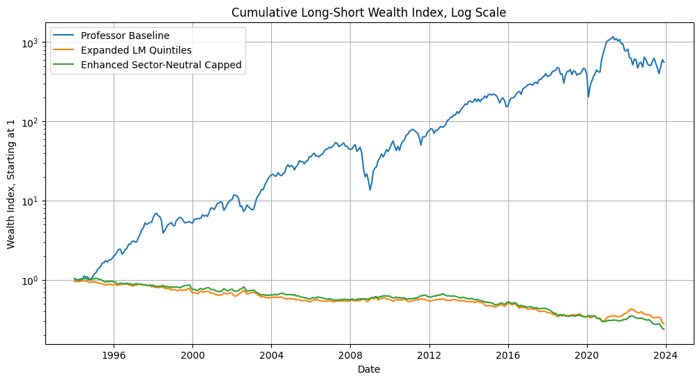
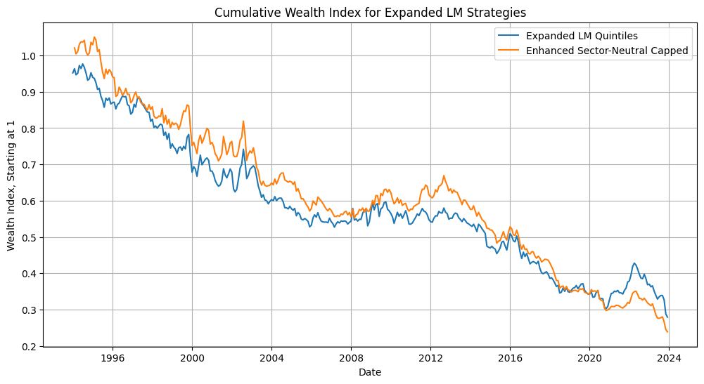
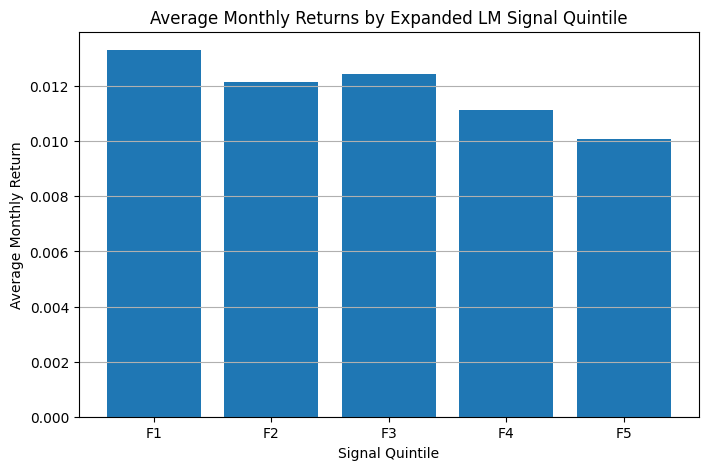
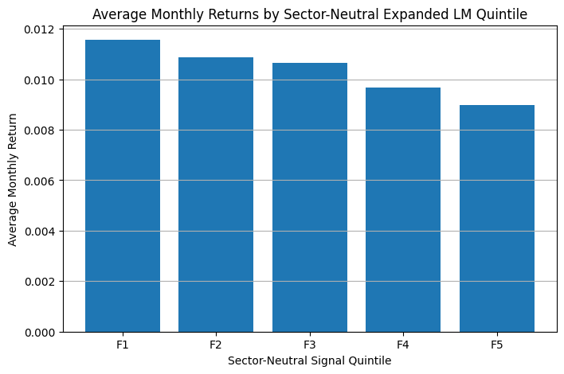

# Investment Applications of NLP: Does 10-K / 10-Q Sentiment Predict Stock Returns?

**Authors:** Jeremy Faubert & Matthias Baker
**Course:** FT370 — Investment Applications of NLP (Profs. Zhang & Babaian)
**Date:** May 2026

---

## Overview

This project tests whether the **sentiment expressed in corporate SEC filings (10-K and 10-Q)** carries information about *future* stock returns. The intuition behind the hypothesis is that qualitative, firm-specific tone is harder for the market to price quickly than hard quantitative metrics, so a measurable lag may exist between when sentiment is disclosed and when it is fully reflected in price (a lag a systematic strategy could potentially capture).

To test this, we built and backtested **three long-short sentiment strategies of increasing complexity** over a 30-year window (1994–2023, ~242,600 firm-month observations) and compared their out-of-sample performance.

**Headline finding:** the *simplest* signal was by far the strongest. Added complexity (more sentiment categories, sector-neutralization, winsorization, and weight caps) consistently *hurt* performance rather than helping it.

---

## Data

| Component | Description |
|---|---|
| **Filings** | SEC 10-K and 10-Q disclosures |
| **Sentiment lexicon** | Loughran-McDonald (LM) financial dictionary: 7 categories: Negative, Positive, Uncertainty, Litigious, Strong Modal, Weak Modal, Constraining |
| **Returns** | Monthly equity returns, merged to filings via CIK / PERMNO |
| **Window** | January 1994 – December 2023 (360 months) |
| **Sample** | ~242,600 firm-month observations |

Filing word counts were used to normalize raw sentiment counts so that longer disclosures did not mechanically dominate the signal.

---

## Methodology

We constructed three strategies, each forming a monthly long-short portfolio and holding it for the following month's return.

### 1. Baseline strategy
A deliberately simple signal: the spread between positive and negative word counts, scaled by uncertainty.

```
Baseline Sentiment = ((N_Positive − N_Negative) / N_Uncertainty) + 1
```

**Portfolio:** long firms with a positive score (> 0), short firms with a negative score.

### 2. Expanded LM Quintiles
A richer model using all seven Loughran-McDonald categories. Scores were normalized by filing length and standardized into monthly **z-scores** so firms could be compared fairly within each month (preventing any single firm from dominating on naturally larger raw values).

**Portfolio:** sort firms into quintiles each month; go long the highest-sentiment quintile (F5) and short the lowest (F1).

### 3. Enhanced Sector-Neutral Capped
A refinement of the expanded model intended to strip out noise and concentration risk:
- **Sector-neutral ranking** using Fama-French industry classifications (FFInd) to remove industry-language bias.
- **Winsorization** of the top and bottom 1% of sentiment scores to limit outlier influence.
- **Signal-strength weighting**, capped at 5% of the portfolio per name, to reward conviction without over-concentrating.

---

## Results

All three strategies were evaluated over the full 360-month sample.

| Metric | Baseline | Expanded LM Quintiles | Enhanced Sector-Neutral Capped |
|---|---:|---:|---:|
| **Avg. monthly long-short return** | **+2.31%** | −0.32% | −0.37% |
| **Annualized return** | **+23.46%** | −4.17% | −4.68% |
| **Hit rate** | **65.56%** | 44.72% | 42.90% |
| **Sharpe ratio** | **0.78** | −0.45 | −0.58 |
| **Information ratio** | **0.23** | −0.13 | −0.17 |
| **Max drawdown** | −74.81% | −71.46% | −77.32% |
| **Average IC** | −0.0058 | −0.0081 | −0.0090 |
| **Cumulative return** | **+55,628%** | −72.12% | −76.16% |

### Cumulative performance (log scale)

The baseline signal compounds to roughly **500×** initial wealth over three decades, while both complex models steadily erode to *below* their starting value.



Isolating the two complex models shows their persistent, grinding decline:



### Quintile (fractile) returns

Tellingly, the expanded and enhanced models show returns *declining* from the low-sentiment quintile (F1) to the high-sentiment quintile (F5), the **opposite** of the intended long-high / short-low design, which is why their long-short spreads came out negative.




### Panel regression

Regressing next-month returns on each sentiment signal across all ~242,600 observations:

| Model | Coefficient | t-stat | p-value | Adj. R² | Observations |
|---|---:|---:|---:|---:|---:|
| Baseline | −0.00141 | −2.58 | 0.0099 | 0.110 | 242,599 |
| Expanded LM | −0.00052 | −4.63 | 0.000004 | 0.110 | 242,663 |

Both signals are statistically significant but carry small, *negative* coefficients at the firm-month level, consistent with the near-zero information coefficients and with the idea that low-sentiment firms are sometimes underpriced rather than simply "bad."

---

## Discussion

**Why did the simple baseline win?** The baseline directly captures the positive-minus-negative tone spread and held up across the full sample, especially when annualized. This supports the core idea that disclosure tone has genuine economic relevance.

**Why did complexity hurt?** All three strategies posted near-zero (slightly negative) information coefficients. For the expanded and enhanced models, the more negative IC suggests they were over-capturing negative sentiment which can be a signal of *underpricing* rather than poor fundamentals. Low sentiment may flag riskier firms or pessimistic market pricing (a risk premium / buying opportunity) rather than future underperformance, so aggressively shorting the lowest-sentiment names worked against the portfolios.

**Drawdowns.** Every strategy suffered a drawdown exceeding 70% at some point, the baseline's worst stretch came after the 2008 crisis, while the complex models' sharpest declines clustered around 2000 and 2003. Signals underperformed most during economic downturns, when sentiment is noisiest and most ambiguous. Firm size, volatility, and portfolio construction all materially amplified drawdowns: if shorted names rally while sentiment fails to reflect it, losses compound quickly.

---

## Limitations & Future Work

- A near-75% maximum drawdown is likely intolerable for a real investor; in practice a sentiment signal would need to be combined with other factors and explicit risk controls.
- A **contrarian model** that deliberately targets the pessimism / underpricing premium (paired with a risk-only benchmark) could turn the observed negative relationship into a usable edge.
- Swapping the Loughran-McDonald lexicon for a **transformer-based model such as FinBERT** may capture context and tone more accurately than dictionary counts.
- Adding **volatility controls, momentum, and disclosure-surprise features** could plausibly produce a genuinely profitable model and is a promising next step.

---

## Conclusion

A sentiment-based investing strategy is viable, but only as one input among several rather than a standalone signal. The most important lesson was methodological: **a more complex model is not always a better one.** The simplest baseline captured the real, persistent value in disclosure tone, while each layer of added sophistication introduced noise that degraded performance.

---

## Repository contents

```
.
├── README.md                         # This report
├── figures/                          # Charts generated by the backtest
├── notebook/Part2_model.ipynb        # Full data pipeline, backtest, and analysis
└── report/Original_Report.docx       # Original write-up
```

*Tech stack: Python, pandas, NumPy, statsmodels, matplotlib, Loughran-McDonald sentiment dictionary.*
